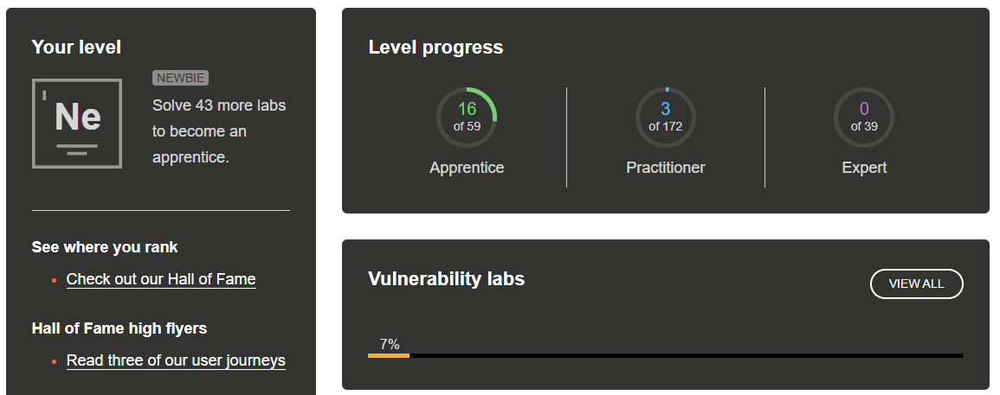

# PortSwigger

## Completed Labs (Total: 19)

### SQL Injection
- SQL injection vulnerability in WHERE clause allowing retrieval of hidden data  
- SQL injection vulnerability allowing login bypass  
- SQL injection attack, querying the database type and version on Oracle  
- SQL injection UNION attack, determining the number of columns returned by the query  

### Cross-Site Scripting (XSS)
- Reflected XSS into HTML context with nothing encoded  
- Stored XSS into HTML context with nothing encoded  
- DOM XSS in `document.write` sink using source `location.search`  
- DOM XSS in `innerHTML` sink using source `location.search`  

### DOM-Based Vulnerabilities
- DOM XSS using web messages  

### XML External Entity (XXE) Injection
- Exploiting XXE using external entities to retrieve files  

### Server-Side Request Forgery (SSRF)
- Basic SSRF against the local server  
- Basic SSRF against another back-end system  

### Access Control Vulnerabilities
- Unprotected admin functionality  
- Unprotected admin functionality with unpredictable URL  
- User role controlled by request parameter  

### Authentication
- Username enumeration via different responses  
- 2FA simple bypass  

### Information Disclosure
- Information disclosure on debug page  
- Information disclosure in error messages  

**Screenshot**  

### Reflection (PortSwigger)

Working through the PortSwigger labs helped me understand how common web vulnerabilities work in real applications. I learned how small implementation mistakes can lead to serious security issues such as SQL injection, XSS, access control bypasses, and information disclosure. The labs improved my ability to analyze requests, understand server behavior, and exploit vulnerabilities responsibly. They also taught me how attackers think and why proper input validation, authentication, and authorization are critical for secure web applications.

---

# The Booking System Project

## Phase 1 – Environment Setup and Application Understanding
**What I did:**  
Set up the booking system using Docker and followed the recorded lectures to run the containers and explore the application.

**What worked:**  
Docker setup and application startup worked correctly.

**What didn’t work:**  
Initially had some confusion with container configuration and ports.

**What took the most time:**  
Understanding how the application components interact.

**What I learned:**  
How containerized applications are deployed and tested from a security perspective.

---

## Phase 2 – Vulnerability Scanning and Reporting
**What I did:**  
Used OWASP ZAP to perform automated security scans and documented the findings.

**What worked:**  
ZAP scanning and report generation.

**What didn’t work:**  
Some scan results required manual verification due to false positives.

**What took the most time:**  
Analyzing vulnerabilities and writing a clear report.

**What I learned:**  
How to report security findings in a professional and structured way.

---

## Phase 3 – Authentication and Authorization Testing
**What I did:**  
Tested authentication and authorization using different roles (guest, reserver, admin) and tools such as ZAP and wfuzz.

**What worked:**  
Role-based testing and manual endpoint verification.

**What didn’t work:**  
Some endpoints were difficult to enumerate.

**What took the most time:**  
Manual authorization testing.

**What I learned:**  
The importance of enforcing strict access control mechanisms.

---

## Phase 4 – GDPR and Security Improvements
**What I did:**  
Updated the GDPR checklist and added a privacy policy, terms of service, and cookie policy.

**What worked:**  
Documentation and compliance checklist updates.

**What didn’t work:**  
Interpreting legal terminology required extra effort.

**What took the most time:**  
Understanding GDPR requirements and how they apply to the application.

**What I learned:**  
How legal compliance and cybersecurity are closely connected.

---

### Reflection (Booking System Project)

The booking system project helped me apply theoretical knowledge to a real-world application. I learned how to use professional tools like OWASP ZAP, wfuzz, and Docker to identify and analyze vulnerabilities. The project showed how important proper authentication, authorization, and GDPR compliance are in modern applications. Writing reports and documenting findings also improved my communication skills, which are essential in cybersecurity work.

---

# Logbook

## Git Repository
GitHub repository link:  
https://github.com/zprakash/CybersecurityAndDataPrivacy2025

### Total Hours
#### Total hours spent: 88.5 hours ####  
#### Hours per topic: [logbook](https://github.com/zprakash/CybersecurityAndDataPrivacy2025/blob/main/logbook.md)
---
